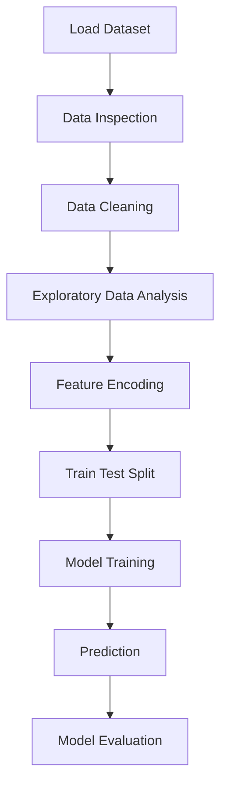

# 🧮 BMI Estimation using Machine Learning


This project focuses on **estimating Body Mass Index (BMI) using Machine Learning** based on **Gender, Height, and Weight**.

The goal of this project is to analyze physical characteristics and build a **predictive model that estimates BMI values** using **Linear Regression**.

This project demonstrates a **complete data science workflow including data preprocessing, exploratory data analysis (EDA), model training, and prediction**.

---

# 📌 Project Overview

Body Mass Index (BMI) is a widely used health indicator that helps determine whether a person has a healthy body weight.

BMI is calculated using:

```
BMI = Weight (kg) / Height² (m²)
```

Instead of calculating BMI manually, this project builds a **machine learning model that predicts BMI using features such as:**

- Gender
- Height
- Weight

The project demonstrates how **machine learning can be applied in healthcare and health analytics**.

---

# 🧠 Machine Learning Workflow



---

# ⚙️ Technologies Used

- Python
- Pandas
- Matplotlib
- Scikit-Learn
- Jupyter Notebook

---

# 📊 Project Steps

## 1️⃣ Data Loading

The dataset contains information about:

- Gender
- Height
- Weight

This dataset is loaded using **Pandas**.

---

## 2️⃣ Data Inspection

Initial data exploration includes:

- Viewing dataset structure
- Checking column names
- Dataset shape
- Statistical summary

---

## 3️⃣ Exploratory Data Analysis (EDA)

EDA helps understand patterns in the dataset.

Analysis includes:

- Distribution of height and weight
- Relationship between variables
- Statistical summaries

Visualization is performed using **Matplotlib**.

---

## 4️⃣ Data Preprocessing

Before training the model:

- Gender values are **encoded into numerical format**
- Features are prepared for model training

---

## 5️⃣ Train-Test Split

The dataset is divided into:

- **Training Data**
- **Testing Data**

This ensures the model can generalize to unseen data.

---

## 6️⃣ Model Training

A **Linear Regression model** is used to estimate BMI.

The model learns relationships between:

- Gender
- Height
- Weight

---

## 7️⃣ Prediction

The trained model predicts BMI values based on input features.

---

# 📂 Project Structure

```
BMI-Estimation-ML
│
├── Estimate the BMI.ipynb
├── weight-height.csv
├── requirements.txt
└── README.md
```

---

# 🚀 How to Run the Project

### 1️⃣ Clone the Repository

```bash
git clone https://github.com/your-username/bmi-estimation-ml.git
```

---

### 2️⃣ Navigate to the Project Folder

```bash
cd bmi-estimation-ml
```

---

### 3️⃣ Install Required Libraries

```bash
pip install -r requirements.txt
```

---

### 4️⃣ Run the Notebook

Open **Jupyter Notebook** and run:

```
Estimate the BMI.ipynb
```

---

# 🎯 Skills Demonstrated

This project demonstrates the following **Data Science skills**:

- Data Cleaning
- Exploratory Data Analysis
- Data Visualization
- Feature Engineering
- Machine Learning Modeling
- Linear Regression
- Python for Data Science

---

# 🌍 Real-World Applications

BMI prediction models can be useful in:

- Healthcare analytics
- Fitness applications
- Health monitoring systems
- Medical research

Such systems help analyze **health indicators and body metrics automatically**.

---

# 👨‍💻 Author

**Taksh Samirkumar Patel**

Computer Science Engineering Student  
Interested in **Artificial Intelligence | Machine Learning | Data Science**

🔗 LinkedIn  
https://www.linkedin.com/in/taksh-patel-6a6b97325

💻 LeetCode  
https://leetcode.com/u/5EWSbJZA6M/

---

⭐ If you found this project useful, consider giving it a **star on GitHub!**
